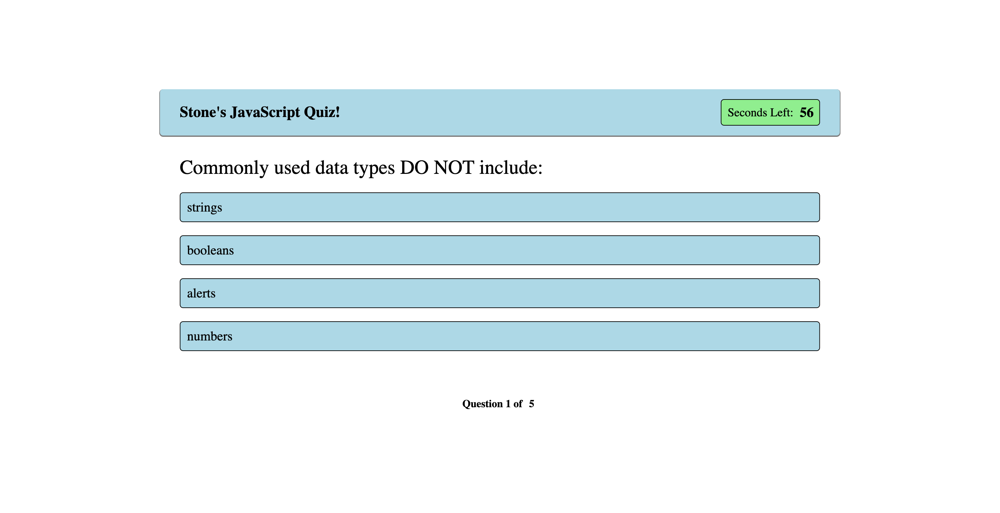

# Javascript Code Quiz

This is a simple 5 question JS Code Uquiz made using Javascript, HTML, and CSS. The main purpose of this quiz is for my own practice with various aspects of Javascript.

## About
The user is presented with a question and a selection of four possible answers. When an answer is selected, the right answer will turn green and the wrong answer(if chosen) will turn red. After that, another question will be displayed. There is a 60 second time limit with a timer displaying your time left in the corner of the quiz. A wrong answer will subtract 5 seconds from your time. If the clock reaches zero, you lose! 

At the end of the quiz, the user is given the option to save their score to the local highscores!

This quiz was built using a variety of functions and event handlers, as well as various loops, array methods, and the localStorage API.

## Screenshot

